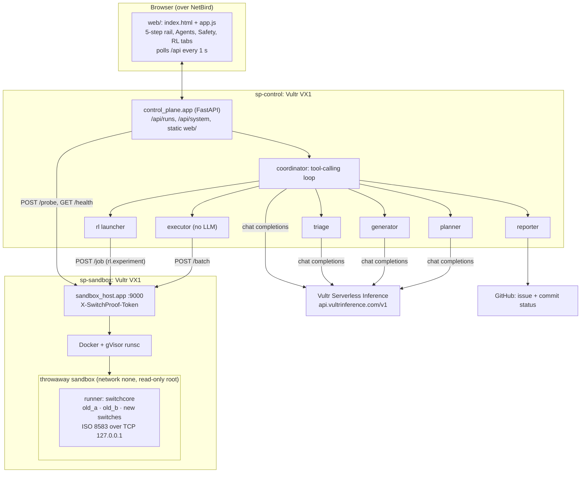
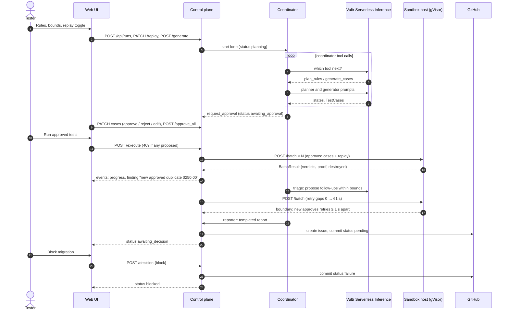

# SwitchProof architecture

API routes, codes and JSON shapes: [CONTRACT.md](CONTRACT.md) and `shared/schemas.py`.

## Components

Trust boundaries:

- **LLM output is data, never code on the control plane.** Generated cases are validated against `TestCase`. The optional `check_script` only ever executes inside a gVisor sandbox.
- **Human gate.** `POST /execute` returns `409` while any case is `proposed`. Replay runs only if the human switched it on (`ReplayConfig.enabled`). Triage follow-ups run without a new approval only when `bounds.auto_followups` is on, and only inside `max_amount_cents` and `allowed_mti`.
- **Sandbox host** accepts only the control plane (token + ufw on the VPC + NetBird policy). Each batch gets a fresh `runsc` container that is destroyed afterwards. A `SandboxProof` (hostname, `uname`, runtime, network, read-only root) comes back with every result.
- **Noise filter.** Two identical legacy switches: if `old_a` and `old_b` disagree, the verdict is `noise`, not `regression`.

## Sequence: generate → approve → execute → triage → decision

## Run states

`draft → planning → awaiting_approval → running → triaging → awaiting_decision → blocked | approved_for_release`

The UI polls `GET /api/runs/{id}` and `GET /api/runs/{id}/events?after=<seq>` every second and stops at a terminal state. Evidence uses `GET /results?verdict=…&limit=200` for the list, plus one unfiltered `GET /results?limit=5000` to find triage follow-ups for the boundary chart.
