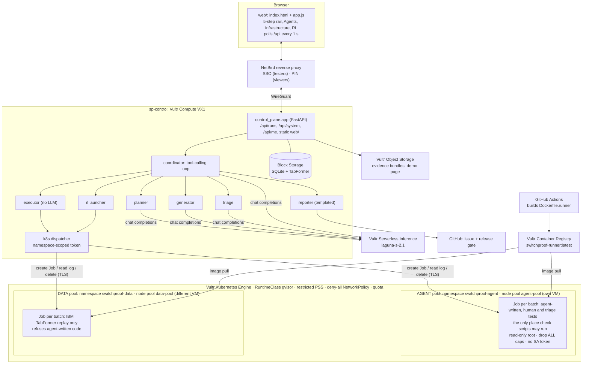

# SwitchProof architecture

API routes, codes and JSON shapes: [CONTRACT.md](CONTRACT.md) and `shared/schemas.py`. Deployment steps: [../infra/README.md](../infra/README.md).

One Vultr VM (`sp-control`) runs the control plane, agents and UI. Test sandboxes run as Kubernetes Jobs on Vultr Kubernetes Engine under a gVisor RuntimeClass. No Docker runs on any VM.

## Components



Trust boundaries:

- **LLM output is data, never code on the control plane.** Generated cases are validated against `TestCase`. The optional `check_script` only ever executes inside a gVisor sandbox pod.
- **Human gate.** `POST /execute` returns `409` while any case is `proposed`. Replay runs only if the human switched it on (`ReplayConfig.enabled`). Triage follow-ups run without a new approval only when `bounds.auto_followups` is on, and only inside `max_amount_cents` and `allowed_mti`. With NetBird SSO, only the `testers` group can act, and the server records the authenticated reviewer.
- **Two sandbox pools.** Agent-written tests (LLM, human and triage follow-ups) run only in namespace `switchproof-agent` on node pool `agent-pool`. The TabFormer replay runs only in `switchproof-data` on `data-pool`, which refuses agent-written code. Agent code and customer-like data never share a sandbox or a machine. Job names start with `sp-agent-` or `sp-data-`, so every proof shows which pool ran it.
- **Sandbox pods** get the gVisor RuntimeClass, restricted Pod Security, a deny-all NetworkPolicy (no egress to the internet, the control plane or the metadata service), no ServiceAccount token, a read-only root, all capabilities dropped, and a quota. The dispatcher's tokens can only manage Jobs in those namespaces. Each Job is deleted after its batch, and a `SandboxProof` (Job name, pod hostname, `uname`, runtime, interfaces, read-only root) comes back with every result.
- **Noise filter.** Two identical legacy switches: if `old_a` and `old_b` disagree, the verdict is `noise`, not `regression`.
- **Local dev** runs the same runner as plain processes (`SANDBOX_MODE=local`), clearly labelled *local-unsafe* in the UI.

## Sequence: generate → approve → execute → triage → decision

```mermaid
sequenceDiagram
  autonumber
  actor H as Tester (NetBird SSO)
  participant UI as Web UI
  participant API as Control plane (sp-control)
  participant CO as Coordinator
  participant LLM as Vultr Serverless Inference
  participant K as VKE (gVisor Jobs)
  participant GH as GitHub

  H->>UI: Rules, bounds, replay toggle
  UI->>API: POST /api/runs, PATCH /replay, POST /generate
  API->>CO: start loop (status planning)
  loop coordinator tool calls
    CO->>LLM: which tool next?
    LLM-->>CO: plan_rules / generate_tests
    CO->>LLM: planner and generator prompts
    LLM-->>CO: states, TestCases
  end
  CO-->>API: request_human_approval (status awaiting_approval)
  UI->>API: PATCH cases (approve / reject / edit), POST /approve_all
  H->>UI: Run approved tests
  UI->>API: POST /execute (409 if any proposed)
  API->>K: AGENT pool: Job for the approved tests · DATA pool: Jobs for the replay
  K-->>API: results + proof from the pod log; Job deleted
  API-->>UI: events: progress, finding "new approved duplicate $250.00"
  CO->>LLM: triage: propose follow-ups within bounds
  API->>K: AGENT pool: follow-up Job (retry gaps 0 … 61 s)
  K-->>API: boundary: new approves retries ≥ 1 s apart
  CO->>API: reporter: templated report, evidence bundle to Object Storage
  API->>GH: create issue, commit status pending
  API-->>UI: status awaiting_decision
  H->>UI: Block migration
  UI->>API: POST /decision {block}
  API->>GH: commit status failure
  API-->>UI: status blocked (reviewer link, if any, closes)
```

## Run states

`draft → planning → awaiting_approval → running → triaging → awaiting_decision → blocked | approved_for_release`

The UI polls `GET /api/runs/{id}` and `GET /api/runs/{id}/events?after=<seq>` every second and stops at a terminal state. Evidence uses `GET /results?verdict=…&limit=200` for the list, plus one unfiltered `GET /results?limit=5000` to find triage follow-ups for the boundary chart.
