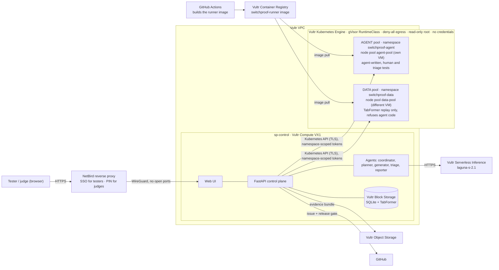

# SwitchProof

**Live demo (recorded run on Vultr, read-only):** https://atl2.vultrobjects.com/switchproof-roshni/site/index.html?snapshot=export.json — 10,022 tests in 42 gVisor sandboxes on Vultr Kubernetes, AI by Vultr Serverless Inference (GLM-5.3 + DeepSeek-v4.1-flash).


**AI agents that test a bank's new payment switch against its old one before go-live. A human approves every test, and every test runs in a throwaway gVisor sandbox.**

Built for the Agent Arena hackathon (Vultr + NetBird), *Blast Radius Zero* track.

## The 30-second problem

In April 2018, UK bank TSB migrated customers from its old core platform to a new one. It went badly wrong: customers were locked out, some saw other people's accounts, and payments failed for weeks. In December 2022 the FCA and PRA fined TSB **£48.65m** for operational resilience failings, on top of the **£32.7m** TSB had already paid customers in redress. Source: FCA press release, 20 Dec 2022, *"FCA and PRA fine TSB £48.65m for operational resilience failings"* (fca.org.uk).

Card processors and US banks face the same risk every time they replace a payment switch. The old switch encodes years of edge cases, like duplicate retries, reversals and insufficient funds. The new one has to match it exactly.

## What SwitchProof does

1. **Rules**: a tester types the payment rules in plain English, plus bounds (max amount, message types).
2. **Review tests**: agents on **Vultr Serverless Inference** plan and write ISO 8583 test cases. **Nothing runs until the human approves or rejects every test.**
3. **Run in sandboxes**: approved tests (plus ~2,000 replayed IBM TabFormer transactions) run as throwaway **Kubernetes Jobs under a gVisor RuntimeClass on Vultr Kubernetes Engine (VKE)**, one Job per batch, in **two separate pools**: agent-written tests in one, the replay data in another, on different VMs. Each sandbox pod sends each message to three mock switches: `old_a` and `old_b` (two identical legacy copies, used to filter noise) and `new`.
4. **Evidence**: the seeded defect shows up. The new switch **approves a duplicate $250.00 purchase retried 5 s later** (the customer is charged twice), while the legacy switch rejects it with `94 Duplicate transmission`. The triage agent automatically runs follow-ups *inside the human's bounds* and finds the boundary ("retries 1 s or more apart get approved"). The reporter files a GitHub issue and sets the release check to pending.
5. **Decision**: the tester clicks **Block migration**, and the GitHub check turns red.

Bonus: an **RL explorer**, trained on CPU inside a sandbox against 7 mutant switches. It finds bugs from the families it was trained on much sooner than random testing, but *not* the held-out duplicate bug. We report that honestly; see [docs/agents.md](agents.md#rl-explorer).

### The agents

| Agent | Brain | Job |
| --- | --- | --- |
| coordinator | Vultr LLM, tool-calling loop | Decides the next tool: plan, generate, request approval, run, triage, report |
| planner | Vultr LLM | Breaks each rule into states worth testing |
| generator | Vultr LLM | Writes ISO 8583 test cases within bounds |
| executor | no LLM | Submits approved cases as gVisor Jobs on VKE, collects results, deletes the Jobs |
| triage | Vultr LLM | Proposes follow-ups to find the failure boundary |
| reporter | no LLM (templated) | Files the GitHub issue, sets the `switchproof/migration-gate` commit status |
| rl | no LLM, CPU | Learned bug-hunting policy |

## Architecture

One Vultr VM (`sp-control`) plus a Vultr Kubernetes Engine cluster for the sandboxes. No Docker runs on any VM.



More detail, including a sequence diagram: [docs/ARCHITECTURE.md](ARCHITECTURE.md).

## How Vultr is used

| Vultr product | What it does here |
| --- | --- |
| **Compute** (VX1 `sp-control`) | Control plane, agents, web UI. The Infrastructure page reads its instance metadata (instance id, region, plan, IPs), so "show me the instance" is one click. |
| **Kubernetes Engine** (VKE) | The sandbox cluster: every test batch is a Kubernetes Job under a gVisor RuntimeClass, deleted after the batch. Two node pools on separate VMs: `agent-pool` (agent-written tests) and `data-pool` (replay data only). |
| **Serverless Inference** (`laguna-s-2.1`) | The LLM behind every agent (`https://api.vultrinference.com/v1`, OpenAI-compatible). The UI shows the model on every LLM call. |
| **Container Registry** | Holds the sandbox runner image. GitHub Actions builds it from `sandbox_host/Dockerfile.runner` and pushes it here. |
| **Object Storage** | One evidence bundle per run (linked from Evidence and Decision), plus the public recorded demo page. |
| **Block Storage** | The run database and the IBM TabFormer dataset on `sp-control` (the Infrastructure page shows the mount). |
| **VPC** | Private network for the VM and the cluster nodes. |

A Vultr firewall group allows SSH from one IP only. No app port is public. The sandbox pods cannot reach the metadata service, and the probe proves it.

Setup: [infra/README.md](infra/README.md).

## NetBird integration (built, not yet enabled on the deployment)

> Honest status: the code, scripts and tests for everything below are in this repo, but the recorded Vultr deployment does not have NetBird switched on yet. Today the live app is reached over an SSH tunnel and the public demo is the read-only recording above. Enabling it: [infra/netbird.md](infra/netbird.md).


- **Zero-port access**: the public URL is served by the NetBird reverse proxy over WireGuard, with no inbound app ports on the Vultr VM. The Infrastructure page shows the NetBird peers (for example the admin laptop, P2P) with path and latency.
- **Identity and roles**: NetBird SSO identifies the user. Members of the `testers` group can approve, run and decide. Everyone else gets a read-only view, and the server records the authenticated identity on the decision.
- **Lifecycle-bound reviewer link**: while a run awaits a decision, a tester can open a temporary PIN-protected link (`netbird expose`). It closes automatically when the migration is blocked or approved.
- The control plane reaches the sandbox cluster only through the Kubernetes API over TLS, with a token scoped to the sandbox namespace. Details: [infra/netbird.md](infra/netbird.md).

## Five safety checkpoints (the Infrastructure page)

1. **Cluster check**: VKE nodes are Ready and the `gvisor` RuntimeClass is present.
2. **Agent ran tests in a sandbox**: every batch records a proof (Job name, runtime).
3. **Proof from inside**: hostname and `uname` captured *inside* the pod. gVisor answers with its own kernel (`4.4.0`), not the node's.
4. **Isolation probe**: a fresh gVisor Job tries `rm -rf /`, internet egress, DNS, reaching the control plane, the cloud metadata service, writing system files and a Docker socket. Each is shown as BLOCKED or ALLOWED.
5. **Teardown**: each Job is deleted after its batch and active sandbox Jobs return to 0.

Agent code and customer-like data never share a sandbox or a machine: agent-written tests run in namespace `switchproof-agent` on node pool `agent-pool`, and the TabFormer replay runs in `switchproof-data` on `data-pool`, which refuses agent-written code.

Every sandbox pod gets: restricted Pod Security · deny-all NetworkPolicy · no ServiceAccount token · read-only root · drop ALL capabilities · ResourceQuota 20 pods · Job deleted after each batch.

Plus the human gate: the server returns `409` if you try to execute while any test is still proposed.

## Data honesty

- Replayed transactions come from **IBM TabFormer, a public synthetic benchmark**. No real cardholder data is used.
- **The defect is seeded** (`dup_window_units`: a 60-second duplicate window read as milliseconds). The mock switches are ours.
- Numbers in `docs/fixtures/` and `web/mock/` (for example 2,012 tests, 41 regressions, the RL curves) are **placeholders** for UI development and the offline demo. They are not results from a real run.

## Run it locally

```bash
pip install -r requirements.txt

# Control plane with offline LLM; uses a fake sandbox when SANDBOX_HOST_URL is unset
LLM_OFFLINE=1 python -m uvicorn control_plane.app:app --port 8000
# open http://127.0.0.1:8000

# Optional: a local (unsafe, dev-only) sandbox host that runs tests as plain processes; on Vultr, sandboxes are gVisor Jobs on VKE
SANDBOX_MODE=local SANDBOX_TOKEN=dev python -m uvicorn sandbox_host.app:app --port 9000
# then start the control plane with:
SANDBOX_HOST_URL=http://127.0.0.1:9000 SANDBOX_TOKEN=dev LLM_OFFLINE=1 python -m uvicorn control_plane.app:app --port 8000

# Scripted end-to-end story from the command line
python -m control_plane.demo_flow

# UI only, no backend: fixtures + simulated story
#   serve web/ (e.g. python -m http.server -d web 8080) and open http://127.0.0.1:8080/index.html?mock=1

# Tests
python -m pytest tests -q

# RL experiment
python -m rl.experiment
```

The UI has one page per step, hash-routed (`#<runId>/overview · rules · approve · run · evidence · decision · agents · infra · rl`; `?run=<id>` also works, and back/forward and deep links behave as expected). The **Overview** page holds the full three.js 3D scene (card terminal → OLD A / OLD B / NEW, the human gate, and the two sandbox pools, driven by the live run) with the next action. **Run**, **Evidence** and **Decision** show the same scene as a compact banner. It is one WebGL renderer, moved between pages and paused where it isn't shown. three.js r186 is vendored in `web/vendor/` (MIT). Without WebGL, with reduced motion, or with `?scene=off`, the scene falls back to an SVG diagram.

UI modes: live (default), `?mock=1` (fixture-driven simulation of all 5 steps; add `&viewer=1` to see the read-only role), `?snapshot=<url of export.json>` (read-only recorded run). Add `?theme=dark` or `?theme=light` to force a theme (dark is the default look for recordings).

## Repo layout

```
shared/          pydantic schemas (source of truth for every JSON shape)
switchcore/      ISO 8583 codec + mock switches (legacy and new, bug flags)
control_plane/   FastAPI app, agents, coordinator loop, Kubernetes Job dispatcher, NetBird, Object Storage, GitHub
sandbox_host/    local-dev sandbox runner + Dockerfile.runner (the image is built in GitHub Actions and pushed to Vultr Container Registry)
rl/              RL explorer and experiment
web/             vanilla JS UI (index.html, app.js, app.css) + mock/ fixtures
infra/           Vultr, VKE (k8s manifests) and NetBird setup scripts, systemd unit, preflight, snapshot publishing
docs/            CONTRACT.md, ARCHITECTURE.md, DEMO.md, fixtures/
tests/           pytest suites (tests/web validates UI fixtures against the schemas)
```

## Team

Built by Roshni and team during the hackathon, with AI coding assistants helping write code and docs under human review. Every design decision, approval gate and demo claim was checked by a person.

## License

MIT, see [LICENSE](LICENSE).
