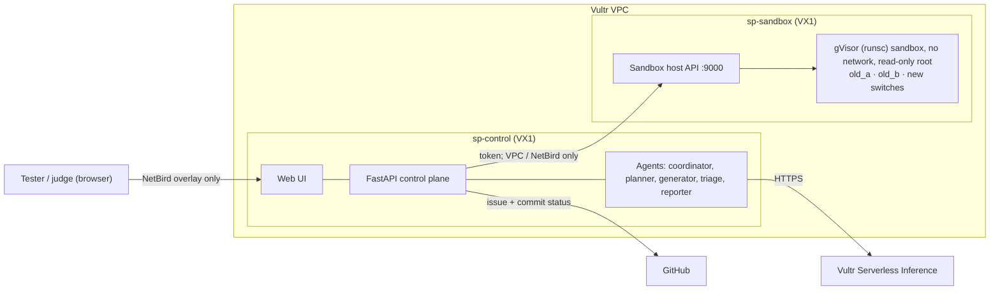

# SwitchProof

**AI agents that test a bank's new payment switch against its old one before go-live. A human approves every test, and every test runs in a throwaway gVisor sandbox.**

Built for the Agent Arena hackathon (Vultr + NetBird), *Blast Radius Zero* track.

## The 30-second problem

In April 2018, UK bank TSB migrated customers from its old core platform to a new one. It went badly wrong: customers were locked out, some saw other people's accounts, and payments failed for weeks. In December 2022 the FCA and PRA fined TSB **£48.65m** for operational resilience failings, on top of the **£32.7m** TSB had already paid customers in redress. Source: FCA press release, 20 Dec 2022, *"FCA and PRA fine TSB £48.65m for operational resilience failings"* (fca.org.uk).

Card processors and US banks face the same risk every time they replace a payment switch. The old switch encodes years of edge cases, like duplicate retries, reversals and insufficient funds. The new one has to match it exactly.

## What SwitchProof does

1. **Rules**: a tester types the payment rules in plain English, plus bounds (max amount, message types).
2. **Review tests**: agents on **Vultr Serverless Inference** plan and write ISO 8583 test cases. **Nothing runs until the human approves or rejects every test.**
3. **Run in sandboxes**: approved tests (plus ~2,000 replayed IBM TabFormer transactions) run in throwaway **gVisor** sandboxes on a separate Vultr VM. Each sandbox sends each message to three mock switches: `old_a` and `old_b` (two identical legacy copies, used to filter noise) and `new`.
4. **Evidence**: the seeded defect shows up. The new switch **approves a duplicate $250.00 purchase retried 5 s later** (the customer is charged twice), while the legacy switch rejects it with `94 Duplicate transmission`. The triage agent automatically runs follow-ups *inside the human's bounds* and finds the boundary ("retries 1 s or more apart get approved"). The reporter files a GitHub issue and sets the release check to pending.
5. **Decision**: the tester clicks **Block migration**, and the GitHub check turns red.

Bonus: an **RL explorer**, trained on CPU inside a sandbox against 7 mutant switches. It finds bugs from the families it was trained on much sooner than random testing, but *not* the held-out duplicate bug. We report that honestly; see [agents.md](agents.md#rl-explorer).

### The agents

| Agent | Brain | Job |
| --- | --- | --- |
| coordinator | Vultr LLM, tool-calling loop | Decides the next tool: plan, generate, request approval, run, triage, report |
| planner | Vultr LLM | Breaks each rule into states worth testing |
| generator | Vultr LLM | Writes ISO 8583 test cases within bounds |
| executor | no LLM | Batches approved cases to the sandbox host |
| triage | Vultr LLM | Proposes follow-ups to find the failure boundary |
| reporter | no LLM (templated) | Files the GitHub issue, sets the `switchproof/migration-gate` commit status |
| rl | no LLM, CPU | Learned bug-hunting policy |

## Architecture



More detail, including a sequence diagram: [docs/ARCHITECTURE.md](ARCHITECTURE.md).

## How Vultr is used

- **2 × VX1 instances** (`sp-control`, `sp-sandbox`) on one **Vultr VPC**. Agent-written tests never execute on the control plane.
- **Vultr Serverless Inference** (`https://api.vultrinference.com/v1`, OpenAI-compatible) powers every LLM agent. The UI shows the model on every LLM call.
- **gVisor sandboxes** on `sp-sandbox`: every batch runs in a fresh `runsc` container with `--network none` and a read-only root, and is destroyed afterwards.
- A Vultr **firewall group** allows SSH from one IP only. No app port is public.

Setup: [infra/README.md](../infra/README.md).

## How NetBird is used

- Both VMs join a NetBird network. Access policies allow **only control plane → sandbox host TCP 9000** and **judges → control plane TCP 8000**.
- The UI is reached over NetBird, not a public port. Details: [infra/netbird.md](../infra/netbird.md).

## Five safety checkpoints (the Safety tab)

1. **Host check**: the sandbox host reports `/dev/kvm` and gVisor `runsc` present, mode `gvisor`.
2. **Agent ran tests in a sandbox**: every batch records a proof (sandbox id, runtime).
3. **Proof from inside**: hostname and `uname` captured *inside* the sandbox. gVisor answers with its own kernel version, not the host's.
4. **Isolation probe**: a fresh sandbox tries `rm -rf /`, internet egress, reaching the control plane, writing the root filesystem, reading host `/etc` and the Docker socket. Each is shown as BLOCKED or ALLOWED.
5. **Teardown**: active sandboxes return to 0, and each sandbox is marked destroyed.

Plus the human gate: the server returns `409` if you try to execute while any test is still proposed.

## Data honesty

- Replayed transactions come from **IBM TabFormer, a public synthetic benchmark**. No real cardholder data is used.
- **The defect is seeded** (`dup_window_units`: a 60-second duplicate window read as milliseconds). The mock switches are ours.
- Numbers in `docs/fixtures/` and `web/mock/` (for example 2,012 tests, 41 regressions, the RL curves) are **placeholders** for UI development and the offline demo. They are not results from a real run.

## Run it locally

```bash
pip install -r requirements.txt

# Control plane with offline LLM; uses a fake sandbox when SANDBOX_HOST_URL is unset
LLM_OFFLINE=1 python -m uvicorn control_plane.app:app --port 8000
# open http://127.0.0.1:8000

# Optional: a real (unsafe, dev-only) local sandbox host
SANDBOX_MODE=local SANDBOX_TOKEN=dev python -m uvicorn sandbox_host.app:app --port 9000
# then start the control plane with:
SANDBOX_HOST_URL=http://127.0.0.1:9000 SANDBOX_TOKEN=dev LLM_OFFLINE=1 python -m uvicorn control_plane.app:app --port 8000

# Scripted end-to-end story from the command line
python -m control_plane.demo_flow

# UI only, no backend: fixtures + simulated story
#   serve web/ (e.g. python -m http.server -d web 8080) and open http://127.0.0.1:8080/index.html?mock=1

# Tests
python -m pytest tests -q

# RL experiment
python -m rl.experiment
```

UI modes: live (default), `?mock=1` (fixture-driven simulation of all 5 steps), `?snapshot=<url of export.json>` (read-only recorded run).

## Repo layout

```
shared/          pydantic schemas (source of truth for every JSON shape)
switchcore/      ISO 8583 codec + mock switches (legacy and new, bug flags)
control_plane/   FastAPI app, agents, coordinator loop, GitHub integration
sandbox_host/    sandbox API, gVisor runner image
rl/              RL explorer and experiment
web/             vanilla JS UI (index.html, app.js, app.css) + mock/ fixtures
infra/           Vultr + NetBird setup scripts, systemd units, preflight, snapshot publishing
docs/            CONTRACT.md, ARCHITECTURE.md, DEMO.md, fixtures/
tests/           pytest suites (tests/web validates UI fixtures against the schemas)
```

## Team

Built by Roshni and team during the hackathon, with AI coding assistants helping write code and docs under human review. Every design decision, approval gate and demo claim was checked by a person.

## License

MIT, see [LICENSE](../LICENSE).
